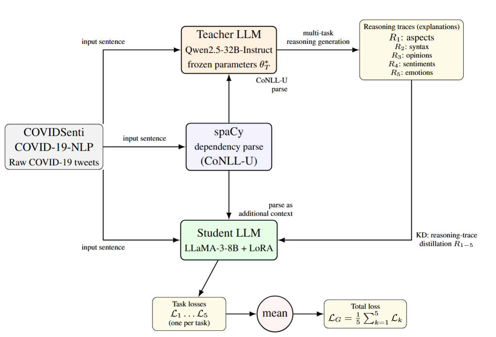
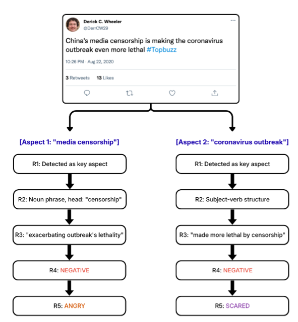

# Effective Knowledge Distillation on Reasoning Chains for Aspect-Based Sentiment and Emotion Analysis

## Overview

This repository provides a framework for knowledge distillation in aspect-based sentiment and emotion analysis. A LLM (teacher) generates step-by-step reasoning traces and annotations for unlabelled text, which are then used to train a smaller student model to learn both intermediate reasoning steps and final predictions.

## Framework 

- **Teacher-Student Knowledge Distillation:**
	- The teacher (large language model) annotates unlabelled data with reasoning chains for five tasks:
		1. Aspect extraction
		2. Syntactic parsing
		3. Opinion extraction
		4. Sentiment classification
		5. Emotion classification
	- The student (smaller model) is trained on these annotations to mimic the teacher's reasoning and predictions.

- **Pipeline Visualization:**
	- 
	- Example teacher annotation: 

## Getting Started

### Installation

1. Clone the repository:
	 ```bash
	 git clone https://github.com/onatakca/synchain-absa-emotion
	 cd synchain-absa-emotion
	 ```
2.  Create and activate a virtual environment:
	 ```bash
	 python -m venv venv
	 source venv/bin/activate
	 ```
3. Install dependencies:
	 ```bash
	 pip install -r requirements.txt
	 ```

## Usage

### 1. Teacher Model Annotation

Run the teacher model to annotate unlabelled data:

```bash
python scripts/annotation/annotate.py
```

### 2. Student Model Training

Train the student model using the generated annotations and configuration files:

```bash
python scripts/modeling/knowledge_distillation.py
```

#### Configuration Files
Configuration files for training are located in:

- `scripts/modeling/configs/`

#### Prompts and Emotion Labels
Prompts and emotion label definitions are in:

- `scripts/qwen_model/prompts.py`

## Data

- **Input Chunks for Teacher Annotation:**
	- `data/input_data/chunks_for_teacher_model_ann/`
- **Teacher Annotated Outputs (e.g., Qwen25-32b-Instruct):**
	- `data/output_data/Qwen25-32b-instruct_annotation/`

